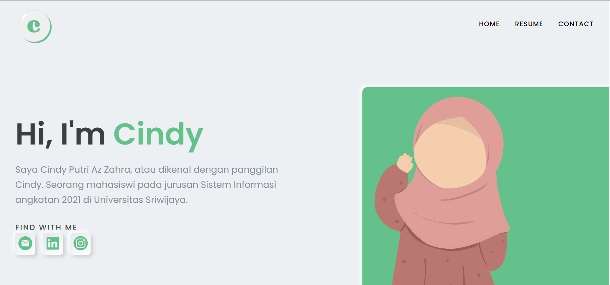

# Cindy Putri Az Zahra

Ini hanyalah website portfolio sederhana tentang saya. Namun lebih **spesial** karena dibuat dengan menggunakan React.js yang ilmunya saya dapatkan dari internal divisi Front-End GDSC Unsri. 

### What's the improved?
- Menerapkan clean code dalam menulis code
- Menerapkan react.js

### How I build this portfolio?
- Buka folder dengan vscode.
- Tuliskan perintah `npm install` untuk memasang package.
- Pikirkan sketsa web untuk components apa saja yang perlu dibuat. Web ini sendiri terdiri dari komponen navbar, home, resume, features, portfolio, contact, dan footer yang beberapa memiliki component kecil lagi di dalamnya seperti component card.
- Buat folder components untuk menampung seluruh components.
- Mulai ngoding dari component yang sederhana terlebih dahulu. Misal mulai dari navbar.
- Selanjutnya terapkan yang sudah dipelajari misal useState yang akan sering digunakan untuk menambahkan state pada komponen fungsional tertentu. 
- Jalankan dengan perintah `npm start`.
