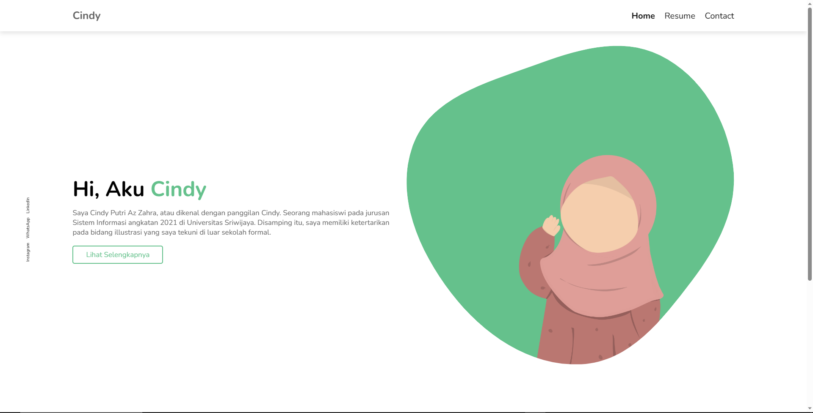

# Cindy Putri Az-Zahra
## 




Website **Portfolio** dan dibuat untuk **Tugas Clean Code**.

Pengerjaan pada **HTML**!

```html
        <section class="home-section" data-sr-id="1" style="visibility: visible; opacity: 1; transform: matrix3d(1, 0, 0, 0, 0, 1, 0, 0, 0, 0, 1, 0, 0, 0, 0, 1); transition: all 0.2s linear 0s, opacity 2s cubic-bezier(0.5, 0, 0, 1) 0s, transform 2s cubic-bezier(0.5, 0, 0, 1) 0s;">
            <div class="home_content">
                <h3 class="home_title">Hi, aku <span class="home_title-color">Cindy</span></h3>
                <p>Saya Cindy Putri Az Zahra, atau dikenal dengan panggilan Cindy. Seorang mahasiswi pada jurusan Sistem Informasi angkatan 2021 di Universitas Sriwijaya. Disamping itu, saya memiliki ketertarikan pada bidang illustrasi yang saya tekuni di luar sekolah formal.</p>
                <a href="#doing-section" class="btn">Lihat Selengkapnya</a>
            </div>
        </section>
```

## Apa Selanjutnya?

- Read the [official documentation](https://docusaurus.io/)
- Modify your site configuration with [`docusaurus.config.js`](https://docusaurus.io/docs/api/docusaurus-config)
- Add navbar and footer items with [`themeConfig`](https://docusaurus.io/docs/api/themes/configuration)
- Add a custom [Design and Layout](https://docusaurus.io/docs/styling-layout)
- Add a [search bar](https://docusaurus.io/docs/search)
- Find inspirations in the [Docusaurus showcase](https://docusaurus.io/showcase)
- Get involved in the [Docusaurus Community](https://docusaurus.io/community/support)
