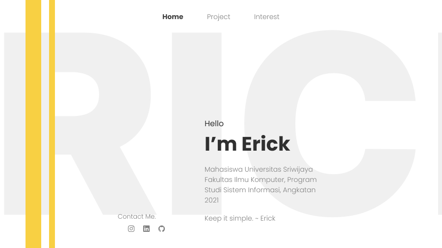

# Erick Prim Caesar



Untuk membuat halaman website seperti ini. Saya harus melakukan design terlebih dahulu tampilan kasarnya di **Figma**, dan kemudian memikirkan warna yang cocok digunakan dihalaman website tersebut. Jika tahap design sudah selesai, selanjutnya kita masuk kebagian **coding-mengoding** :>

## Coding-mengoding

### HTML

Untuk code **HTML**, simpel saja tidak ada yang sulit dimengerti. Hanya saja disini saya menggunakan **Vanilla CSS** dan **JavaScript**, sehingga tidak semua code baik **CSS** dan **JavaScript** saya buat sendiri tanpa bantuan framework sama sekali.

```jsx title="index.html"
<!DOCTYPE html>
<html lang="en">
  <head>
    <meta charset="UTF-8" />
    <meta http-equiv="X-UA-Compatible" content="IE=edge" />
    <meta name="viewport" content="width=device-width, initial-scale=1.0" />
    <title>My Personal Portfolio Website</title>

    <link rel="stylesheet" href="res/css/import.css" />
    <link rel="stylesheet" href="res/css/style.css" />
    <link rel="stylesheet" href="res/css/index-page.css" />
  </head>
  <body>
    <span class="bg">ERICK</span>
    <div class="line1"></div>
    <div class="line2"></div>
    <nav>
      <a href="index.html"><b>Home</b></a>
      <a href="projects.html">Project</a>
      <a href="interest.html">Interest</a>
    </nav>
    <section>
      <div class="left">
        <span>Contact Me.</span>
        <a href=""></a>
        <a href=""></a>
        <a href=""></a>
      </div>
      <div class="right">
        <span>Hello</span>
        <h1>I'm Erick</h1>
        <p>
          Mahasiswa Universitas Sriwijaya Fakultas Ilmu Komputer, Program Studi
          Sistem Informasi, Angkatan 2021
        </p>
        <span class="quote">Keep it simple. ~ Erick</span>
      </div>
    </section>

    <script src="res/js/script.js"></script>
  </body>
</html>
```

### CSS

Untuk code **CSS** ini juga simpel. Tidak ada yang spesial.

```jsx title="res/css/index-page.css"
section {
  position: absolute;
  display: flex;
  bottom: 5rem;
  gap: 0rem;
  left: calc(50% - 25rem);
}

section p,
.quote {
  width: 22.5rem;
  font-size: 1.25rem;
  font-weight: 300;
  color: #808080;
}

section h1 {
  font-size: 3.12rem;
  font-weight: 700;
}

.right {
  margin-top: 9.3rem;
  margin-left: 10rem;
}

.right span {
  font-size: 1.25rem;
}

.right h1 {
  margin-top: 0.5rem;
}

.line1 {
  left: 4rem;
}

.line2 {
  left: 9.3rem;
}

.left {
  margin-top: 25rem;
}

.left span {
  display: block;
  font-size: 1.25rem;
  font-weight: 300;
  color: #808080;
}

.left img {
  margin-top: 0.5rem;
  margin-left: 1rem;
  width: 1.6rem;
  height: 1.6rem;
}
```

### JavaScript

Untuk **JavaScript** ini saya gunakan agar **Background** dari website dapat **bergerak mengikuti Cursor**.

```jsx title="res/js/script.js"
const parallax = (event) => {
  bg = document.querySelector(".bg");
  const x = (window.innerWidth + event.pageX * 10) / 90;
  const y = (window.innerHeight + event.pageY * 10) / 90;

  bg.style.transform = `translateX(calc(-50% + ${x}px)) translateY(calc(-50% + ${y}px))`;
};

document.addEventListener("mousemove", parallax);
```