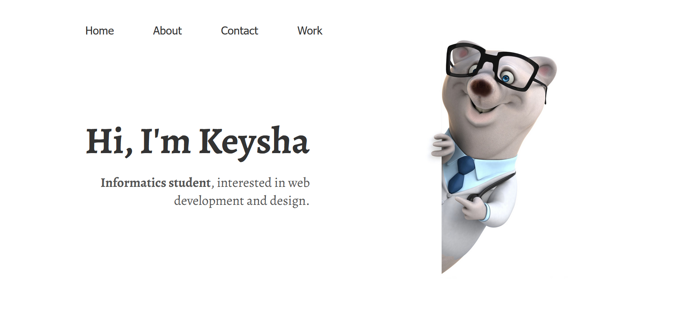

# Keysha Zascha Medina

Gambar di atas adalah **website portofolio** yang aku kembangkan.

Website tersebut tampilannya cukup sederhana, di bagian atas terdapat _navigation menu_. 

Kemudian, di bawahnya terdapat bagian _contents_.

Mau tau bagaimana website tersebut dibuat? Yuk, simak lebih lanjut!

## How I Build My Portfolio Website?

### Prepare The Tools

- Text editor
- Browser

_Yeah, That's it_. Website tersebut hanya menggunakan HTML dan CSS. Jadi, text editor (seperti VS Code) dan Browser saja sudah cukup untuk mengembangkan web portofolio ini.

### Build The Website

- Pertama, buat folder di komputer, lalu buka folder tersebut menggunakan text editor.
- Tambahkan file HTML.
- Buat struktur file HTML yang terdiri dari tag _html_, _head_, dan _body_.
- Di bagian body, buat wrapper dengan CSS display flex.
- Buat 2 wrapper lagi dengan class "left" dan "right" untuk tampilan bagian kiri dan kanan website.
- Pada bagian "left", buat _navigation menu_ kemudian berikan CSS flex agar menu berjejer ke samping. Notes: _Tiap menu diapit dengan tag anchor (tag a)_
- Masih di bagian left, tambahkan konten yang berisi pengenalan diri secara umum.
- Pada bagian "right" tambahkan gambar.
- Kemudian, buat file baru untuk setiap menu pada navigation dan isi file-file tersebut sesuai keinginan.
- Sematkan alamat dari file pada menu di navigation.
- Selesai! Website Portofolio berhasil dibuat!
