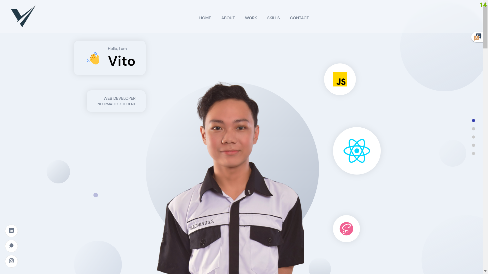

# Zildjian Vito Sulaiman

### Website Portofolio yang dibuat menggunakan Basic **React** dan **SASS**

### Penjelasan Website Tersebut

1. Akses Websitenya Melalui Link ini **[zildjianvito.me](http://zildjianvito.me)**.

2. Kemudian setelah masuk ke websitenya akan langsung disuguhkan dengan Hero Section dan Navigation bar yang mana masing masing list dari navbar ini mengarah ke section yang berbeda pada website tersebut.

3. Coba perhatikan di tiap bagian Section pada halaman website tersebut pada saat lebar layar Laptop atau diatasnya di pojok kiri bawah terdapat 3 icon yang mana masing masing icon akan menavigasi ke Sosmed saya sendiri.

4. Pada bagian Kanan setiap section Website tersebut juga terdapat tombol navigasi yang pada saat di hover akan berubah warna menjadi ungu kebiruan dan pada saat diklik akan menavigasi ke section yang berbeda pada Website tersebut tergantung urutan sectionnya.

5. Nah,hal tersebut dapat terjadi dikarenakan pada tiap section di Website tersebut saya bungkus terlebih dahulu menggunakan Higher Order Component yang mana HOC ini memungkinkan Component yang dibungkusnya akan memiliki logic/layout yang sama .

6. dst...

## Tech Stack?

- React
- Sass
- Framer Motion
